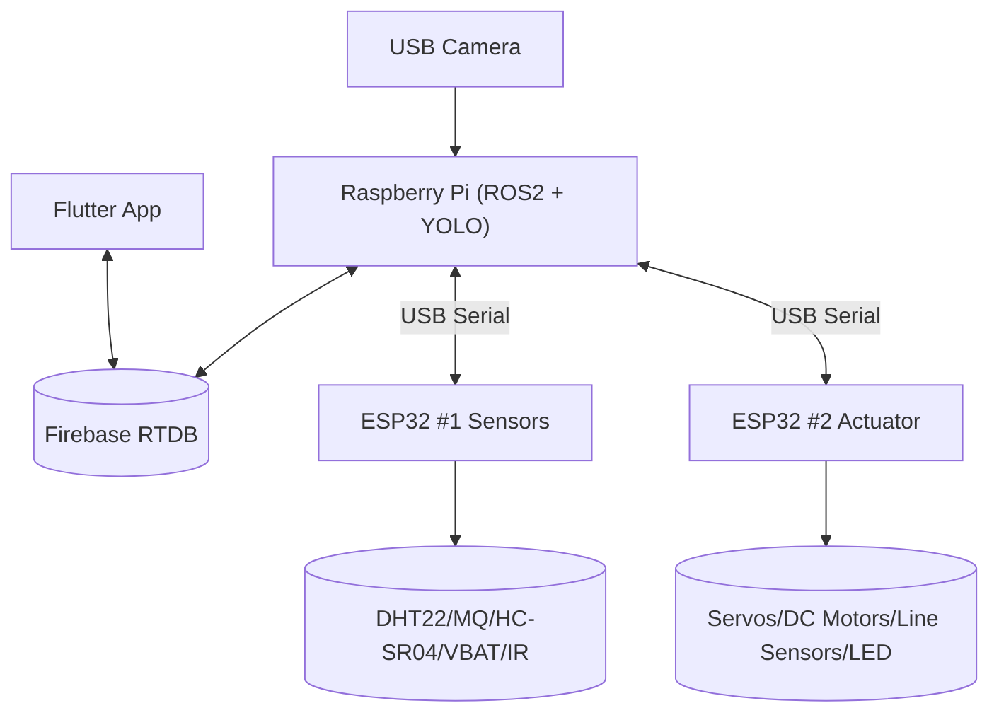

# Báo cáo lập trình dự án “Smart Trash Bin / Trash Detection”

Ngày cập nhật: 2026-05-30

Tài liệu này tóm tắt **ngôn ngữ**, **tools**, và **kiến trúc code** theo từng phần của workspace.

## 1) Tổng quan hệ thống

Hệ thống được chia làm 3 lớp chính:

- **MCU (ESP32)**: đọc cảm biến + điều khiển cơ khí/di chuyển thời gian thực.
- **Edge (Raspberry Pi, ROS2)**: điều phối quy trình, chạy YOLO, giao tiếp Serial với ESP32.
- **Cloud + App (Firebase RTDB + Flutter)**: lưu dữ liệu realtime và hiển thị/điều khiển.



## 2) Cấu trúc workspace (theo thư mục)

- `robot/MCU/`
  - `esp32_sensor/esp32_sensor.ino`: firmware ESP32 #1 (Sensors).
  - `esp32_actuator/esp32_actuator.ino`: firmware ESP32 #2 (Actuator + line following).
- `robot/Pi/trash_sorting_ros/`: ROS2 package chạy trên Raspberry Pi.
  - `trash_sorting_ros/*.py`: node ROS2 (Python).
  - `config/pipeline.yaml`: tham số, port USB serial, model YOLO, Firebase.
  - `launch/bringup.launch.py`: launch toàn bộ pipeline.
  - `docs/ROS_ARCHITECTURE.md`: mô tả kiến trúc ROS2 (đã viết).
- `user_interface/`: Flutter app (GetX + Firebase RTDB).
- `Training/`: notebook huấn luyện/EDA (Jupyter).
- `YOLO-Waste-Detection-main/`: repo YOLO tham khảo + weights `best_model.pt`.
- `code_test/`: các sketch test/bench cho ESP32 (sensor readout, servo tuning, line sensor test…).

## 3) Ngôn ngữ sử dụng

- **C/C++ (Arduino / ESP32)**
  - Firmware ESP32 #1 và #2.
- **Python 3 (ROS2 + AI + Cloud bridge)**
  - Node ROS2 (`rclpy`), YOLO inference (`ultralytics`), camera (`opencv-python`), Firebase REST (`requests`), Serial (`pyserial`).
- **Dart (Flutter)**
  - Mobile UI + Firebase RTDB client.
- **YAML**
  - Cấu hình ROS2 (`pipeline.yaml`).
- **Markdown**
  - Tài liệu kỹ thuật.
- **Jupyter Notebook**
  - Phần training/đánh giá mô hình.

## 4) Tools / Framework / Thư viện

### 4.1 ESP32 (MCU)

- Toolchain:
  - Arduino IDE / Arduino core cho ESP32 (hoặc PlatformIO nếu dùng).
- Libraries (theo code hiện tại):
  - `DHT.h` (DHT22)
  - `ESP32Servo.h` (servo PWM)
- Debug:
  - Serial Monitor (USB), baud **115200**.

### 4.2 Raspberry Pi (ROS2)

- ROS2 + build:
  - `rclpy` (ROS2 Python)
  - `colcon build` (ament_python)
  - `ros2 launch` (bringup)
- Python dependencies: xem `robot/Pi/trash_sorting_ros/requirements.txt`
  - `pyserial`, `requests`, `opencv-python`, `ultralytics`
- Camera:
  - OpenCV `cv2.VideoCapture`.
- Firebase:
  - REST PATCH/GET tới Firebase RTDB.

### 4.3 Flutter App

- Flutter SDK + Dart SDK
- State management: `get`
- Firebase: `firebase_core`, `firebase_database`
- UI libs: `fl_chart`, `google_fonts`, `intl`, `percent_indicator`, `shimmer`, `flutter_animate`

## 5) Kiến trúc code theo từng phần

### 5.1 ESP32 #1 — Sensor Node (`robot/MCU/esp32_sensor/esp32_sensor.ino`)

**Mục tiêu:**
- Đọc 3× DHT22, 3× MQ-2, 3× MQ-135
- Đọc 3× HC-SR04 (mức đầy)
- Đọc VBAT
- Đọc IR object sensor
- Gửi dữ liệu lên Pi qua USB serial

**Kiến trúc code:**
- Loop chính:
  - `handlePiCommands()` đọc lệnh `CMD:*`.
  - `pollIr()` đẩy `IR:<0|1>` khi thay đổi.
  - Theo chu kỳ: `readAllSensors()` → `checkAlerts()` → `sendSensorDataToPi()`.

**Protocol chính (ESP1 → Pi):**
- `SENSOR:...` (CSV đầy đủ)
- `LEVELS:l1,l2,l3`
- `BATTERY:vbat`
- `IR:0|1`
- `ALERT:FIRE`, `ALERT:GAS`

**Protocol điều khiển (Pi → ESP1):**
- `CMD:READ_SENSORS`, `CMD:READ_LEVELS`, `CMD:READ_BATTERY`, `CMD:READ_IR`

### 5.2 ESP32 #2 — Actuator + Navigation (`robot/MCU/esp32_actuator/esp32_actuator.ino`)

**Mục tiêu:**
- Servo:
  - SG1: gạt/rơi rác
  - SG2: chọn ngăn
  - SG3: nắp/aux (có thể continuous 360)
- Di chuyển:
  - L298N điều khiển 2 động cơ DC
  - 5 cảm biến line analog → PID bám line
- Giao tiếp:
  - Nhận command từ Pi qua USB serial
  - Trả `STATUS:*` và telemetry `ACT:*` (khi `CMD:STATUS` hoặc các điểm dừng)

**State machine chính:**
- `STATE_IDLE`, `STATE_SORTING`, `STATE_MOVING`, `STATE_RETURNING_HOME`, `STATE_LINE_LOST`

**Commands (Pi → ESP2):**
- `CMD:SERVO_OPEN`, `CMD:SERVO_CLOSE`
- `CMD:CLASSIFY:<0|1|2>`
- `CMD:MOVE_START`, `CMD:MOVE_HOME`, `CMD:MOVE_STOP`
- `CMD:STATUS`
- `CMD:LED:<RED|GREEN|YELLOW|OFF>`

**Status (ESP2 → Pi):**
- `STATUS:IDLE`, `STATUS:SORTING:<n>`, `STATUS:SORT_DONE`, `STATUS:MOVING`, `STATUS:ARRIVED_DUMP`, `STATUS:ARRIVED_HOME`, `STATUS:LINE_LOST`
- `STATUS:RX:<cmd>` echo debug

### 5.3 ROS2 trên Pi (`robot/Pi/trash_sorting_ros`)

**Mục tiêu:**
- Kết nối 2 ESP32 qua USB serial.
- Điều phối luồng: IR → mở/đóng nắp → YOLO → phân loại → cập nhật Firebase.
- Nhận lệnh từ Firebase: go_dump / go_home.

**Các node (launch `bringup.launch.py`):**
- `sensor_bridge`: serial ESP1 → publish `/trash_bin/sensors`, `/trash_bin/levels`, `/trash_bin/object_detected`, ...
- `actuator_bridge`: serial ESP2 ←→ `/esp32_actuator/cmd`, publish `/esp32_actuator/status`, `/trash_bin/actuator`
- `trash_orchestrator`: state machine điều phối, publish `/trash_bin/state`
- `yolo_classifier`: nhận request, chụp frame, chạy YOLO, publish classification JSON
- `firebase_bridge`: upload dữ liệu + poll commands

**Cấu hình:**
- `config/pipeline.yaml`:
  - Port USB theo `/dev/serial/by-path/...`
  - `baudrate=115200`
  - Tham số YOLO (model path, camera index, confidence)
  - Firebase RTDB url, token, poll interval

(Tài liệu chi tiết về ROS graph/node/topic xem `robot/Pi/trash_sorting_ros/docs/ROS_ARCHITECTURE.md`.)

### 5.4 Flutter App (`user_interface/`)

**Mục tiêu:**
- Hiển thị dữ liệu realtime (sensors/levels/battery/alerts/state/navigation).
- (Tùy thiết kế app) gửi command điều khiển qua Firebase RTDB.

**Kiến trúc code:**
- Sử dụng **GetX** theo module pattern:
  - `lib/app/modules/.../controllers`
  - `lib/app/modules/.../views`
  - `lib/app/modules/.../bindings`
- Routing: `lib/app/routes/*`
- Theme: `lib/app/theme/*`

**Firebase:**
- Init trong `lib/main.dart` với `FirebaseOptions` + `databaseURL`.

### 5.5 AI/Training

- Notebook nội bộ: `Training/Phân_loại_rác.ipynb`
- Repo tham khảo YOLO: `YOLO-Waste-Detection-main/YOLO-Waste-Detection-main/`
  - Weights: `best_model.pt`
  - Notebook demo: `Waste_Detection.ipynb`

## 6) Ghi chú nhất quán tài liệu

- `implementation_plan.md` mô tả kế hoạch tổng quan (có phần UART/stepper). Implementation hiện tại đang theo hướng **USB Serial + servo selector/drop/lid**, và ROS2 package đã phản ánh cấu hình thật trong `config/pipeline.yaml`.
- Protocol triển khai (Serial messages) nên lấy chuẩn theo:
  - Firmware ESP32 (`robot/MCU/...`)
  - ROS2 protocol parser (`robot/Pi/trash_sorting_ros/trash_sorting_ros/protocol.py`)

## 7) Cách build/run (tóm tắt)

### Pi (ROS2)

```bash
mkdir -p ~/trash_ws/src
cp -r robot/Pi/trash_sorting_ros ~/trash_ws/src/
cd ~/trash_ws
python3 -m pip install -r src/trash_sorting_ros/requirements.txt
colcon build --symlink-install
source install/setup.bash
ros2 launch trash_sorting_ros bringup.launch.py
```

### Flutter

```bash
cd user_interface
flutter pub get
flutter run
```

### ESP32

- Flash bằng Arduino IDE (hoặc PlatformIO).
- Monitor Serial `115200`.

hghghg