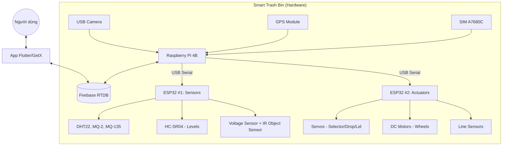

# Kiến trúc Hệ thống & Giao thức Giao tiếp

Hệ thống Thùng rác Thông minh được thiết kế theo mô hình **Edge-to-Cloud**, kết hợp giữa xử lý tại biên (Raspberry Pi), điều khiển thời gian thực (ESP32) và giám sát từ xa (Firebase & Flutter).

## 1. Sơ đồ Kiến trúc

## 2. Giao tiếp UART (Pi ↔ ESP32)
    ## 2. Giao tiếp Serial (Pi ↔ ESP32)
Dữ liệu được trao đổi qua Serial với tốc độ **9600 baud**.
    Hai ESP32 hiện tại giao tiếp với Raspberry Pi qua **USB Serial (UART0 bridge qua cổng Type‑C)**.

    - Baud rate triển khai trong code hiện tại: **115200**.
    - Mỗi message kết thúc bằng ký tự xuống dòng `\n`.
### A. ESP32 #1 (Sensor Node) ↔ Raspberry Pi

**Lệnh từ Pi gửi xuống ESP1:**
- `CMD:READ_SENSORS`: Yêu cầu đọc toàn bộ cảm biến môi trường.
- `CMD:READ_LEVELS`: Yêu cầu kiểm tra độ đầy của 3 ngăn rác.
- `CMD:READ_BATTERY`: Kiểm tra điện áp pin.
- `CMD:READ_IR`: Đọc trạng thái cảm biến IR.

**Phản hồi từ ESP1 lên Pi:**
- `STATUS:SENSOR_READY`: ESP1 đã khởi động xong và sẵn sàng.
- `SENSOR:<t1>,<h1>,<t2>,<h2>,<t3>,<h3>,<mq2_1>,<mq2_2>,<mq2_3>,<mq135_1>,<mq135_2>,<mq135_3>,<lvl1>,<lvl2>,<lvl3>,<vbat>,<ir_state>`: Snapshot đầy đủ dữ liệu.
- `LEVELS:<l1>,<l2>,<l3>`: Phần trăm đầy của 3 ngăn.
- `BATTERY:<vbat>`: Điện áp pin (V).
- `IR:<0|1>`: Trạng thái IR.
- `ALERT:FIRE`: Cảnh báo cháy (nhiệt độ cao hoặc khói).
- `ALERT:GAS`: Cảnh báo rò rỉ khí gas.

---

### B. ESP32 #2 (Actuator Node) ↔ Raspberry Pi

**Lệnh điều khiển từ Pi xuống ESP2:**
- `CMD:SERVO_OPEN`: Mở nắp khoang nhận rác.
- `CMD:SERVO_CLOSE`: Đóng nắp khoang nhận rác.
- `CMD:CLASSIFY:<0/1/2>`: Xoay mâm phân loại vào ngăn tương ứng (0: Nhựa/Lon, 1: Hữu cơ, 2: Khác).
- `CMD:MOVE_START`: Bắt đầu di chuyển bám line đến điểm tập kết.
- `CMD:MOVE_STOP`: Dừng di chuyển.
- `CMD:MOVE_HOME`: Quay về vị trí ban đầu bám line.
- `CMD:LED:<RED/GREEN/YELLOW/OFF>`: Điều khiển đèn trạng thái.

**Phản hồi trạng thái từ ESP2 lên Pi:**
- `STATUS:IDLE`: Đang ở trạng thái chờ.
- `STATUS:RX:<cmd>`: Echo lại lệnh vừa nhận (phục vụ debug).
- `STATUS:SORTING:<0/1/2>`: Đang thực hiện xoay mâm phân loại.
- `STATUS:SORT_DONE`: Đã phân loại xong.
- `STATUS:MOVING`: Robot đang di chuyển.
- `STATUS:ARRIVED_DUMP`: Đã đến điểm đổ rác (đi theo line).
- `STATUS:ARRIVED_HOME`: Đã về home (đi theo line).
- `STATUS:LINE_LOST`: Mất dấu line, robot đã dừng lại để đảm bảo an toàn.

**Telemetry từ ESP2 lên Pi (theo lệnh `CMD:STATUS` hoặc khi dừng):**
- `ACT:<state>,<moving>,<bin>,<line_pos>,<active>,<raw1>..<raw5>,<str1>..<str5>`

## 3. Luồng hoạt động chính (Workflow)

1. **Chế độ chờ:** ESP1 đo cảm biến theo chu kỳ và gửi lên Pi qua Serial; Pi chịu trách nhiệm tổng hợp và upload lên Firebase.
2. **Tiếp nhận:** IR object sensor (đang đọc ở ESP1) phát hiện người/vật -> ESP1 gửi `IR:<0|1>` (và/hoặc Pi chủ động `CMD:READ_IR`) -> Pi ra lệnh `CMD:SERVO_OPEN`.
3. **Nhận diện:** Pi chụp ảnh từ USB camera -> chạy YOLO -> xác định loại rác.
4. **Phân loại:** Pi gửi `CMD:CLASSIFY:X` cho ESP2 -> ESP2 chọn ngăn + gạt -> báo `STATUS:SORT_DONE`.
5. **Cập nhật:** Pi có thể gọi `CMD:READ_LEVELS` từ ESP1 để cập nhật mức đầy lên Firebase.
6. **Thu gom:** Khi rác đầy -> Pi gửi `CMD:MOVE_START` để đi tới điểm tập kết; sau đó gửi `CMD:MOVE_HOME` để quay về home.
