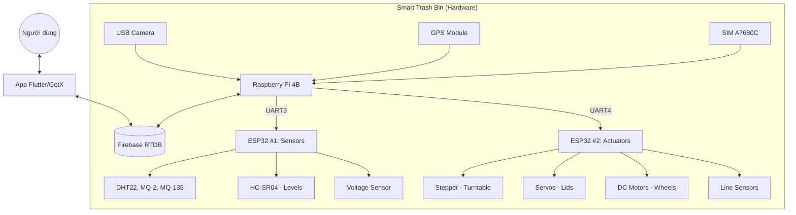

# Kiến trúc Hệ thống & Giao thức Giao tiếp

Hệ thống Thùng rác Thông minh được thiết kế theo mô hình **Edge-to-Cloud**, kết hợp giữa xử lý tại biên (Raspberry Pi), điều khiển thời gian thực (ESP32) và giám sát từ xa (Firebase & Flutter).

## 1. Sơ đồ Kiến trúc

## 2. Giao tiếp UART (Pi ↔ ESP32)

Dữ liệu được trao đổi qua Serial với tốc độ **9600 baud**.

### A. ESP32 #1 (Sensor Node) ↔ Raspberry Pi

**Lệnh từ Pi gửi xuống ESP1:**
- `CMD:READ_SENSORS`: Yêu cầu đọc toàn bộ cảm biến môi trường.
- `CMD:READ_LEVELS`: Yêu cầu kiểm tra độ đầy của 3 ngăn rác.
- `CMD:READ_BATTERY`: Kiểm tra điện áp pin.

**Phản hồi từ ESP1 lên Pi:**
- `SENSOR:<t1>,<h1>,<t2>,<h2>,<t3>,<h3>,<mq2_1>,...,<vbat>`: Chuỗi dữ liệu cảm biến.
- `LEVELS:<l1>,<l2>,<l3>`: Phần trăm đầy của 3 ngăn.
- `ALERT:FIRE`: Cảnh báo cháy (nhiệt độ cao hoặc khói).
- `ALERT:GAS`: Cảnh báo rò rỉ khí gas.

---

### B. ESP32 #2 (Actuator Node) ↔ Raspberry Pi

**Lệnh điều khiển từ Pi xuống ESP2:**
- `CMD:SERVO_OPEN`: Mở nắp khoang nhận rác.
- `CMD:SERVO_CLOSE`: Đóng nắp khoang nhận rác.
- `CMD:CLASSIFY:<0/1/2>`: Xoay mâm phân loại vào ngăn tương ứng (0: Nhựa/Lon, 1: Hữu cơ, 2: Khác).
- `CMD:MOVE_START`: Bắt đầu di chuyển bám line đến điểm tập kết.
- `CMD:MOVE_STOP`: Dừng di chuyển.
- `CMD:MOVE_HOME`: Quay về vị trí ban đầu bám line.
- `CMD:LED:<RED/GREEN/YELLOW/OFF>`: Điều khiển đèn trạng thái.

**Phản hồi trạng thái từ ESP2 lên Pi:**
- `STATUS:IDLE`: Đang ở trạng thái chờ.
- `STATUS:SORTING:<0/1/2>`: Đang thực hiện xoay mâm phân loại.
- `STATUS:SORT_DONE`: Đã phân loại xong và mâm đã về vị trí home.
- `STATUS:MOVING`: Robot đang di chuyển.
- `STATUS:ARRIVED`: Đã đến đích (hoặc đã về nhà).
- `STATUS:LINE_LOST`: Mất dấu line, robot đã dừng lại để đảm bảo an toàn.

## 3. Luồng hoạt động chính (Workflow)

1. **Chế độ chờ:** ESP1 gửi dữ liệu môi trường lên Firebase 5 giây/lần.
2. **Tiếp nhận:** Cảm biến IR (nối ESP2) phát hiện người -> Pi ra lệnh `CMD:SERVO_OPEN`.
3. **Nhận diện:** Nắp đóng -> Pi kích hoạt Camera -> Chạy YOLO -> Xác định loại rác.
4. **Phân loại:** Pi ra lệnh `CMD:CLASSIFY:X` cho ESP2 -> ESP2 xoay mâm -> Rác rơi -> Mâm về home.
5. **Cập nhật:** ESP1 đo lại `LEVELS` và cập nhật lên Firebase.
6. **Thu gom:** Khi rác đầy (100%) -> App thông báo -> Pi ra lệnh `CMD:MOVE_START` cho ESP2 di chuyển đến trạm tập kết.
