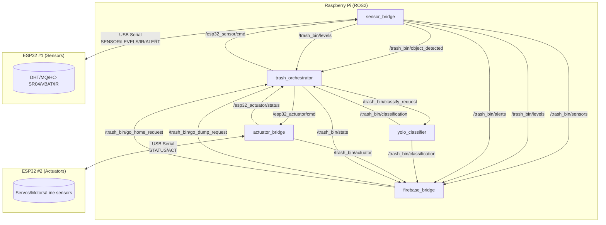

# Kiến trúc ROS2 trên Raspberry Pi (trash_sorting_ros)

Tài liệu này mô tả kiến trúc ROS2 đang triển khai trong package **`trash_sorting_ros`** trên Raspberry Pi: các node, topic, tham số, và luồng điều khiển từ **IR → mở nắp → chụp ảnh/YOLO → phân loại → cập nhật Firebase → (tùy chọn) chạy dò line đi đổ/về nhà**.

## 1) Tổng quan

- ROS2 distro: dùng **Python (`rclpy`)**.
- ESP32 giao tiếp với Pi qua **USB Serial** (xem `config/pipeline.yaml`).
- Pi chịu trách nhiệm:
  - Orchestrate (trạng thái + gửi command xuống ESP32)
  - YOLO inference (camera)
  - Upload Firebase (REST)
  - Poll command từ Firebase (go_dump / go_home)

## 2) Sơ đồ node (ROS graph)

## 3) Các node chính

### 3.1 `sensor_bridge`

**Vai trò:**
- Kết nối USB serial tới ESP32 sensor.
- Poll định kỳ `CMD:READ_SENSORS` (theo `poll_interval`).
- Parse các line `SENSOR:...`, `LEVELS:...`, `IR:...`, `ALERT:...`, `BATTERY:...`.

**Publish:**
- `/esp32_sensor/raw` (`std_msgs/String`): raw line từ serial.
- `/trash_bin/sensors` (`std_msgs/String` JSON): payload đã parse (nhiệt độ/độ ẩm/mq/levels/vbat/ir_state...).
- `/trash_bin/levels` (`std_msgs/Int32MultiArray`): 3 phần trăm mức đầy.
- `/trash_bin/alerts` (`std_msgs/String`): `fire`, `gas`, ...
- `/trash_bin/object_detected` (`std_msgs/Bool`): event từ IR.

**Subscribe:**
- `/esp32_sensor/cmd` (`std_msgs/String`): forward command xuống ESP1.

**Tham số (`pipeline.yaml`):**
- `port`, `baudrate`, `read_timeout`, `reconnect_delay`
- `poll_interval` (giây)
- `ir_detected_state`: IR module active-low/active-high.

### 3.2 `actuator_bridge`

**Vai trò:**
- Kết nối USB serial tới ESP32 actuator.
- Forward các lệnh `CMD:*` xuống ESP2.
- Parse:
  - `STATUS:*` → publish lên `/esp32_actuator/status`
  - `ACT:*` → parse telemetry line sensors → publish JSON lên `/trash_bin/actuator`

**Publish:**
- `/esp32_actuator/raw` (`std_msgs/String`): raw line + các marker `BRIDGE_TX_*`.
- `/esp32_actuator/status` (`std_msgs/String`): status.
- `/trash_bin/actuator` (`std_msgs/String` JSON): telemetry.

**Subscribe:**
- `/esp32_actuator/cmd` (`std_msgs/String`): command từ orchestrator/Firebase.

**Lưu ý:**
- `ACT:` có thể không xuất hiện liên tục; phụ thuộc firmware ESP2 (có thể chỉ in khi `CMD:STATUS` hoặc khi dừng).

### 3.3 `trash_orchestrator`

**Vai trò:** state machine chính.

**Subscribe:**
- `/trash_bin/object_detected` (IR)
- `/trash_bin/classification` (YOLO result)
- `/esp32_actuator/status`
- `/trash_bin/levels`
- `/trash_bin/go_dump_request`, `/trash_bin/go_home_request` (từ Firebase)

**Publish:**
- `/esp32_actuator/cmd`: `CMD:SERVO_OPEN`, `CMD:SERVO_CLOSE`, `CMD:CLASSIFY:<0|1|2>`, `CMD:MOVE_START`, `CMD:MOVE_HOME`, `CMD:LED:*`...
- `/esp32_sensor/cmd`: ví dụ `CMD:READ_LEVELS`
- `/trash_bin/classify_request`: trigger 1 lần chụp/infer.
- `/trash_bin/state`: state text (`idle`, `sorting`, `dump_outbound`, ...)

**Luồng intake/sort (happy path):**
1. IR detect object → mở nắp (`CMD:SERVO_OPEN`) + LED.
2. Đợi `lid_open_seconds` → đóng nắp (`CMD:SERVO_CLOSE`).
3. Đợi `capture_delay_seconds` → publish `/trash_bin/classify_request`.
4. Nhận `/trash_bin/classification` → map ra bin → gửi `CMD:CLASSIFY:<bin>`.
5. Khi nhận `STATUS:SORT_DONE` → yêu cầu `CMD:READ_LEVELS` + trả state về `idle`.

**Luồng full bin:** nếu max(levels) ≥ `full_threshold_percent` → gửi `full_bin_move_command` (mặc định `CMD:MOVE_START`).

### 3.4 `yolo_classifier`

**Vai trò:** chụp 1 frame từ camera và chạy YOLO.

- Subscribe: `/trash_bin/classify_request` (`std_msgs/Empty`)
- Publish: `/trash_bin/classification` (`std_msgs/String` JSON)

**Tham số:** model, camera index, resolution, warmup, confidence, mapping class→bin.

### 3.5 `firebase_bridge`

**Vai trò:**
- PATCH dữ liệu lên Firebase RTDB qua REST.
- Poll `commands/go_dump` và `commands/go_home` từ Firebase → phát event vào ROS.

**Subscribe:** sensors / levels / alerts / classification / state / actuator

**Publish:**
- `/trash_bin/go_dump_request` (`std_msgs/Empty`)
- `/trash_bin/go_home_request` (`std_msgs/Empty`)

## 4) Topics (tóm tắt)

| Topic | Type | Producer → Consumer |
| --- | --- | --- |
| `/esp32_sensor/raw` | `String` | sensor_bridge → debug |
| `/esp32_sensor/cmd` | `String` | orchestrator → sensor_bridge |
| `/trash_bin/sensors` | `String` (JSON) | sensor_bridge → firebase_bridge |
| `/trash_bin/levels` | `Int32MultiArray` | sensor_bridge → orchestrator/firebase_bridge |
| `/trash_bin/alerts` | `String` | sensor_bridge → firebase_bridge |
| `/trash_bin/object_detected` | `Bool` | sensor_bridge → orchestrator |
| `/trash_bin/classify_request` | `Empty` | orchestrator → yolo_classifier |
| `/trash_bin/classification` | `String` (JSON) | yolo_classifier → orchestrator/firebase_bridge |
| `/esp32_actuator/cmd` | `String` | orchestrator → actuator_bridge |
| `/esp32_actuator/status` | `String` | actuator_bridge → orchestrator |
| `/trash_bin/actuator` | `String` (JSON) | actuator_bridge → firebase_bridge |
| `/trash_bin/state` | `String` | orchestrator → firebase_bridge |
| `/trash_bin/go_dump_request` | `Empty` | firebase_bridge → orchestrator |
| `/trash_bin/go_home_request` | `Empty` | firebase_bridge → orchestrator |

## 5) Bringup / cấu hình

- Launch: `launch/bringup.launch.py` chạy đủ 5 node.
- Cấu hình: `config/pipeline.yaml`.

Gợi ý: nếu đổi cổng USB, sửa `sensor_bridge.port` và `actuator_bridge.port` trong `pipeline.yaml` sang `/dev/serial/by-id/...` hoặc `/dev/ttyUSB*` tương ứng.
